# EMG Hand Gesture Classification

This repository contains a small end-to-end pipeline for **hand gesture classification** using **3-channel EMG (electromyography)** signals.  
The long-term motivation is to use EMG-based gestures for simple **HCI controls**, and this project focuses on building and comparing **classical ML baselines**.

> **Dataset is NOT included** in this repository.

## Summary
- Collect EMG recordings for multiple gesture classes (A–F) using **3 sensors**.
- Preprocessing + feature extraction pipeline:
  - Split each recording into fixed-length segments (windows).
  - Extracted time-domain and frequency-domain features per channel.
- Train and evaluate multiple classifiers:
  - **KNN**, **SVM**, **Softmax Regression**, **Random Forest**
- Visualized results with **classification reports** and **confusion matrices**.
- Additional experiment: reduced the gesture set (A–F → A,B,C,D,F → A,C,F) to observe how class overlap affects performance.


## Methodology
### 1) Windowing
Each EMG recording is segmented into fixed-length windows.  
This helps convert raw time-series signals into a consistent sample format for feature extraction.

### 2) Feature Extraction
Per channel (`raw1`, `raw2`, `raw3`), the pipeline extracts:
- **Time-domain features**: mean, std, max/min, range, variance, median, RMS, skewness, MAD
- **Frequency-domain features**: FFT mean magnitude, FFT max magnitude

### 3) Training & Evaluation
- Standardize features using `StandardScaler`
- Train/test split
- Evaluate with:
  - Accuracy
  - Classification report (precision/recall/F1)
  - Confusion matrix


## Setup
```bash
pip install numpy pandas scikit-learn matplotlib seaborn scipy
````

## Run

```bash
python KNN.py
python SVM.py
python LG.py
# Random Forest: open RF.ipynb and run the cells
```


## Data (Not Included)

This repo does **not** include EMG CSV files.
If you want to run the code, place your CSV files under something like:

```
./data/EMG_data/
```


## Example: Raw EMG Signals

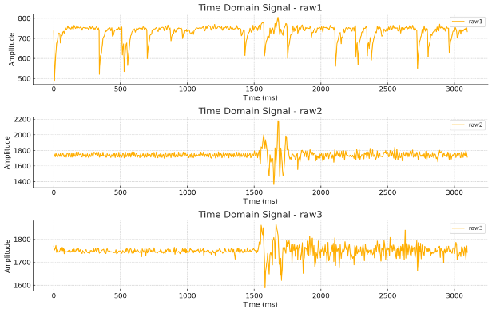


## Results (All classes: A–F)

### KNN
<p>
  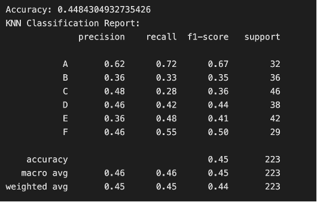
  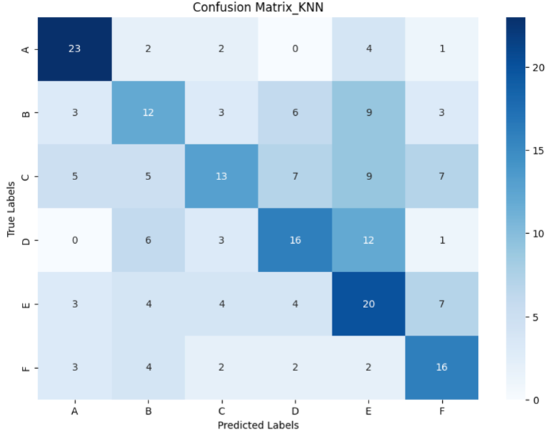
</p>


### Softmax Regression
<p>
  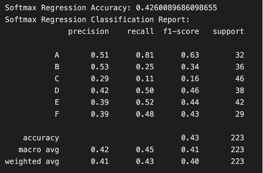
  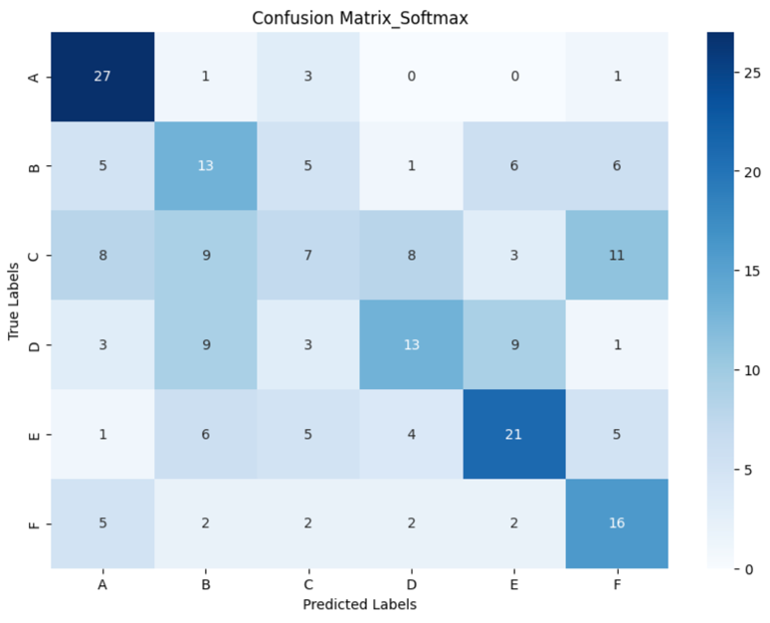
</p>


### SVM
<p>
  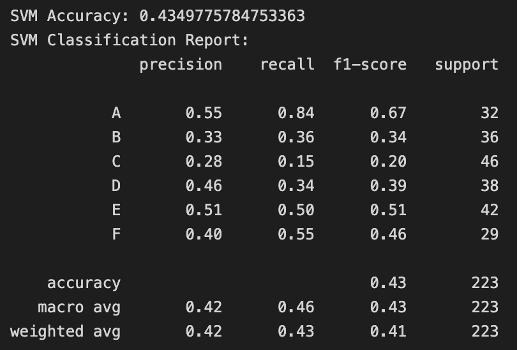
  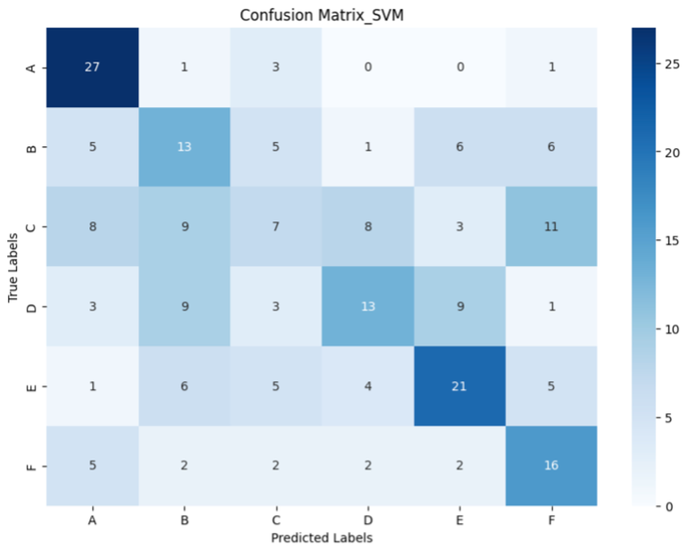
</p>


### Random Forest
<p>
  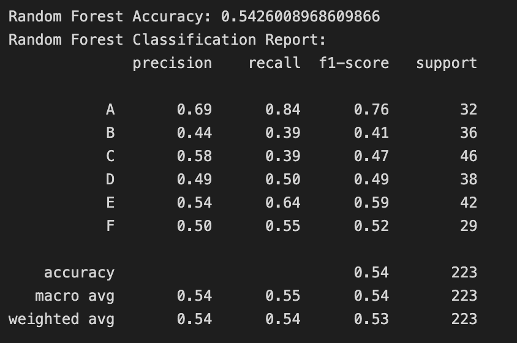
  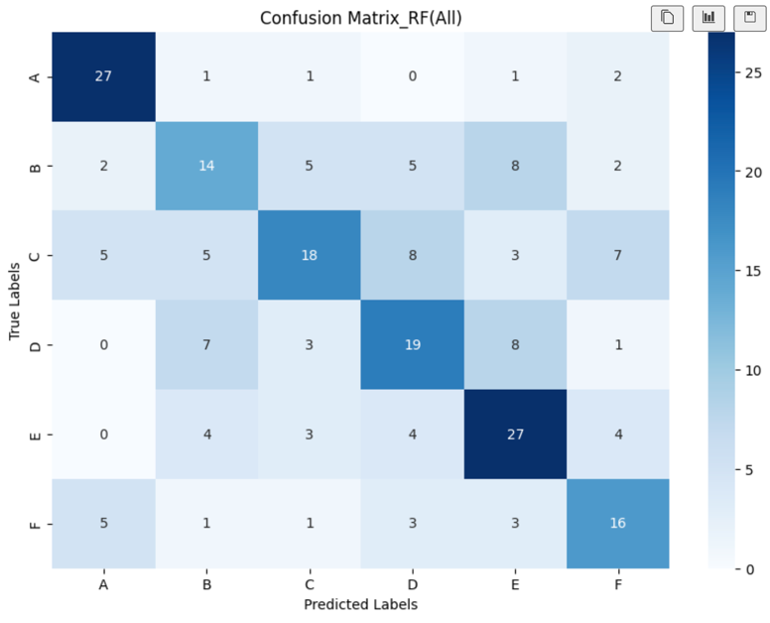
</p>


## Random Forest: Reduced Class Experiments

To investigate class overlap / ambiguity, I also trained Random Forest models on reduced gesture sets.

### A, B, C, D, F (E removed)
<p>
  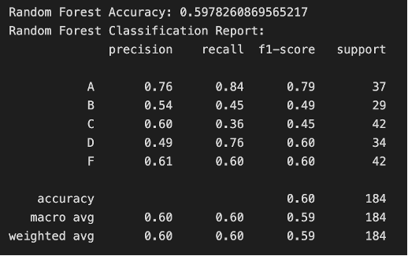
  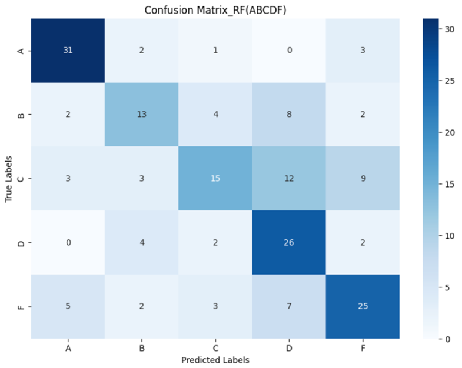
</p>


### A, C, F (3-class subset)
<p>
  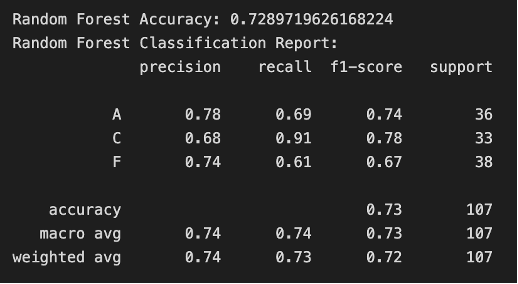
  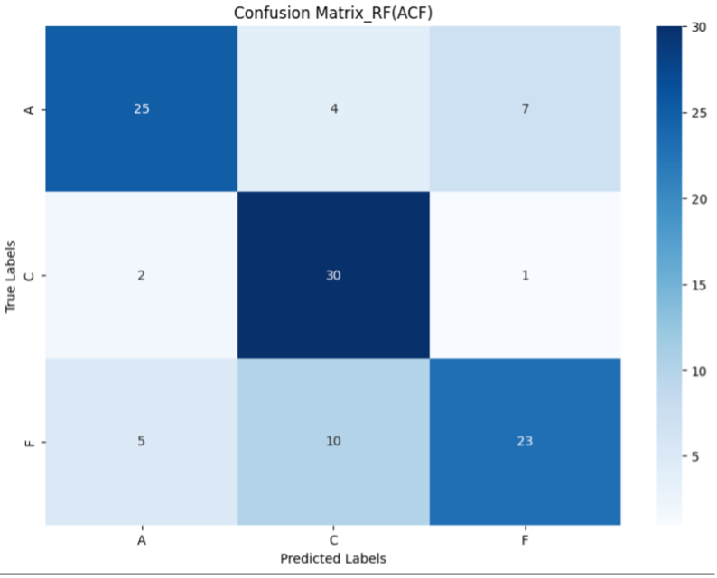
</p>

